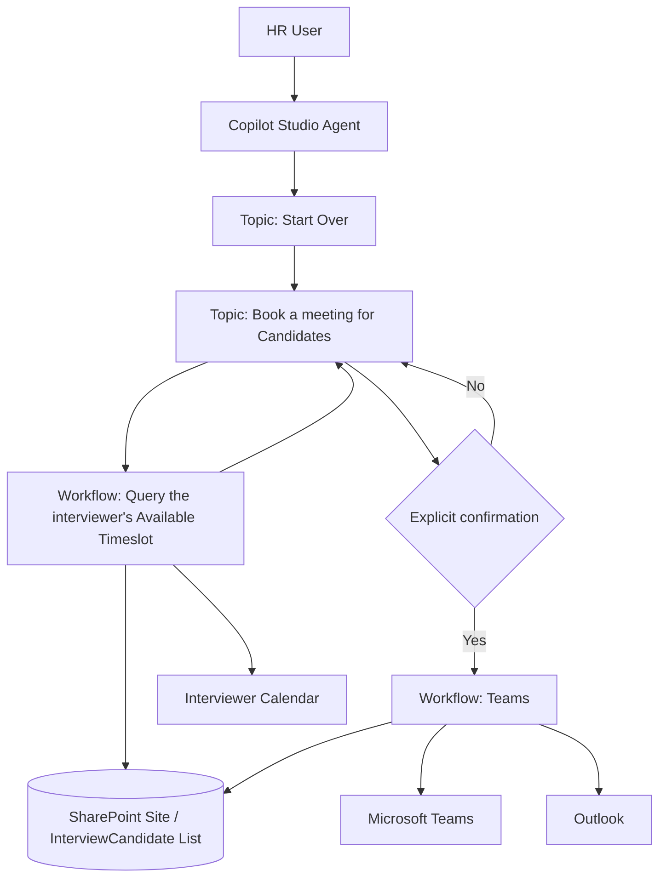
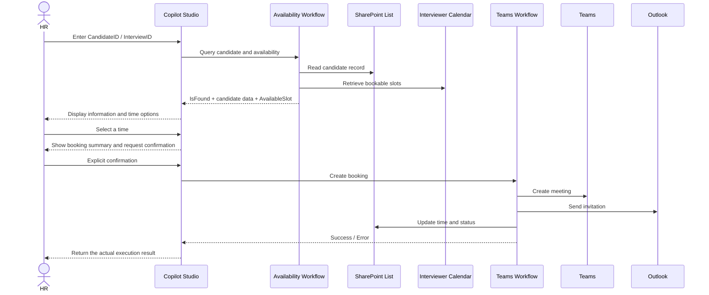
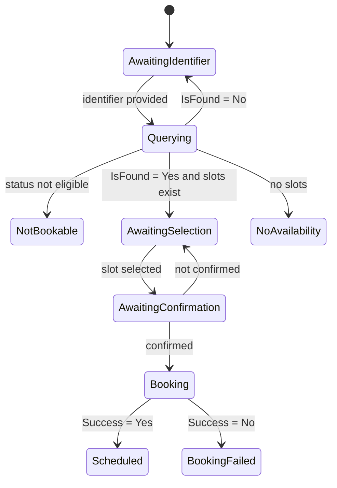

# Architecture

## 1. Logical Architecture

## 2. Component Responsibilities

### Copilot Studio Agent

- Understands user intent
- Enters the appropriate Topic
- Collects the CandidateID or InterviewID
- Displays information returned by Workflows
- Manages time selection and confirmation
- Produces controlled responses based on returned results

### Topic: Start Over

- Displays the welcome message and business menu
- Routes to single-candidate booking
- Gives a controlled explanation for batch booking and analysis capabilities that are not yet enabled

### Topic: Book a meeting for Candidates

- Obtains the candidate ID
- Calls the Availability Workflow
- Evaluates `IsFound`, `Status`, and `AvailableSlot`
- Stores the user's selected time
- Obtains explicit confirmation before calling the Teams Workflow

### Workflow: Query the interviewer's Available Timeslot

**Input:** InterviewID or CandidateID  
**Output:** IsFound, AvailableSlot, CandidateName, Position, Status, InterviewEmail, CandidateEmail

Responsibilities:

- Query the SharePoint candidate record
- Query the interviewer's available times
- Return a structured result to the agent

### Workflow: Teams

**Input:** Candidate identifier, SelectedStartTime, CandidateName, CandidateEmail, InterviewerEmail, Position

Responsibilities:

- Create the Microsoft Teams meeting
- Send the Outlook interview invitation
- Update the SharePoint InterviewTimeSlot
- Update Status to `Scheduled`
- Return a success or failure result

## 3. Data Flow

## 4. State Control

## 5. Key Design Decisions

- **Live data first:** Candidate data must never be generated by the model itself.
- **Separation of reads and writes:** The query Workflow handles reads; the Teams Workflow handles writes.
- **Explicit confirmation:** The user must confirm before a meeting is created.
- **Result-driven responses:** The agent may only declare success when a Workflow explicitly returns success.
- **Recoverable failures:** Clear feedback is provided for empty IDs, not-found candidates, no availability, meeting failures, and status update failures.
